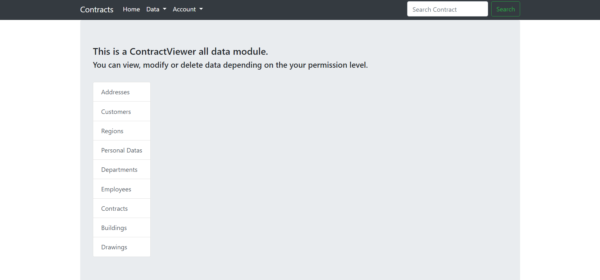

# ContractViewer App
> Manage and view contracts as a user with limited permissions.
> Live demo [_here_](https://contractviewer.herokuapp.com/). <!-- If you have the project hosted somewhere, include the link here. -->

Login details user: `User_1`/`Useruser123`
Login details admin: `admin`/`Adminadmin123`

## Table of Contents
* [General Info](#general-information)
* [Technologies Used](#technologies-used)
* [Features](#features)
* [Screenshots](#screenshots)
* [Demo](#demo)
* [Setup](#setup)
* [Project Status](#project-status)
* [Room for Improvement](#room-for-improvement)
* [Acknowledgements](#acknowledgements)
* [Contact](#contact)
<!-- * [License](#license) -->


## General Information
- Application was created to improve the information flow in company's projects. 
- Depending on the permission level you can view resources that are in database.
- Moreover, you can add, modify, delete, filter and search data.
- General purpose is quick access to information what projects are in company and who is responsible for them.
- I made this project because I want to develop my skills in making Python and Django projects.

<!-- You don't have to answer all the questions - just the ones relevant to your project. -->


## Technologies Used
- Python - version 3.9
- Django - version 3.2
- PostgreSQL - version 13.3
- Docker - version 20.10


## Features
List the ready features here:
- Filter and pagination for every model ListView
- Search field for search in contracts using multiple queryset.
- User account service
- PDF report of contract


## Screenshots




<!-- If you have screenshots you'd like to share, include them here. -->

## Demo

See the current build live by launching the main branch on a free Heroku instance. You will need a Free Heroku account if you havent already got an active account.

[](https://www.heroku.com/deploy?template=https://github.com/bartoszsklodowski/ContractViewer)

Login details user: `User_1`/`Useruser123`
Login details admin: `admin`/`Adminadmin123`

## Setup

What are the project requirements/dependencies? Where are they listed? A requirements.txt or a Pipfile.lock file perhaps? Where is it located?

Proceed to describe how to install / setup one's local environment / get started with the project.

#### The first thing to do is to clone the repository:

```sh
$ git clone https://github.com/bartoszsklodowski/ContractViewer.git
$ cd ContractViewer
```

#### Create a virtual environment to install dependencies in and activate it:

```sh
$ virtualenv2 --no-site-packages env
$ source env/bin/activate
```

#### Then install the dependencies:

```sh
(env)$ pip install -r requirements.txt
```
Note the `(env)` in front of the prompt. This indicates that this terminal
session operates in a virtual environment set up by `virtualenv2`.

#### Migrate database

`python manage.py migrate`


#### Create superuser

Create a local admin user by entering the following command:

`python manage.py createsuperuser`

#### Create PostgreSQL database

Create a local postgres database using this tutorial and then change local_settings to put your database credentials.

[_Create database_](https://www.postgresqltutorial.com/postgresql-create-database/)

#### Start the app

`python manage.py runserver 0.0.0.0:8000 --settings=ContractViewer.local_settings`

#### Add initial data

You can add initial data either by going to the url the app is running on locally and adding `/admin` to the url.

Add some categories and you should be all set.

Or by entering 

`python manage.py loaddata fixtures.json`

## Tests

To run the tests, `cd` into the directory where `manage.py` is:
```sh
(env)$ python pytest
```

## Deploy with Docker

### Prerequisites:

- Docker - version 20.10

Windows hosts must use Education or more advanced versions to run Docker \
Download: https://innsida.ntnu.no/wiki/-/wiki/English/Microsoft+Windows+10

### Install:

```sh
$ git clone https://github.com/bartoszsklodowski/ContractViewer.git
$ cd ContractViewer
```

### Change DATABASES settings:

Go into `ContractViewer/settings` and uncomment settings for Docker and comment settings for Heroku.

### Run:

```sh
$ docker-compose up --build
```
Hosts the application on http://localhost:8000 with default settings

### Test reset password:

If you want to check reset password function you must go into Docker container:
```sh
$ docker exec -it contract_viewer /bin/bash
```

And start email DebuggingServer:
```sh
$ python -u -m smtpd -n -c DebuggingServer localhost:1025
```
You will receive you reset password link in the terminal.

[comment]: <> (## Technology)

[comment]: <> (- **deployment** Docker)

[comment]: <> (- **web** Nginx)

[comment]: <> (- **database** Postgre SQL)

[comment]: <> (- **backend** Django 3 with Django REST framework)

[comment]: <> (- **application** )

[comment]: <> (    - **browser** - HTML5/CSS/JS, Bootstrap v5 &#40;no jQuery dependency&#41;)

[comment]: <> (    - **mobile** Apache Cordova &#40;uses same website&#41;)

[comment]: <> (- **authentication** JWT)


[comment]: <> (## Code and structure)

[comment]: <> (.gitlab-ci.yml - gitlab ci)

[comment]: <> (requirements.txt - Python requirements)

[comment]: <> (package.json - Some node.js requirements, this is needed for cordova)

[comment]: <> (- **secfit/** django project folder containing the project modules)

[comment]: <> (  - **<application_name>/** - generic structure of a django application)

[comment]: <> (    - **admins.py** - file contaning definitions to connect models to the django admin panel)

[comment]: <> (    - **urls.py** - contains mapping between urls and views)

[comment]: <> (    - **models.py** - contains data models)

[comment]: <> (    - **permissions.py** - contains custom permissions that govern access)

[comment]: <> (    - **serializers.py** - contains serializer definitions for sending data between backend and frontend)

[comment]: <> (    - **parsers.py** - contains custom parsers for parsing the body of HTTP requests)

[comment]: <> (    - **tests/** - contains tests for the module. [View Testing in Django]&#40;https://docs.djangoproject.com/en/2.1/topics/testing/&#41; for more.)

[comment]: <> (    - **views.py** - Controller in MVC. Methods for rendering and accepting user data)

[comment]: <> (    - **forms.py**  -  definitions of forms. Used to render html forms and verify user input)

[comment]: <> (    - **settings.py** - Contains important settings at the application and/or project level)

[comment]: <> (    - **Procfile** - Procfile for backend heroku deployment)

[comment]: <> (  - **media/** - directory for file uploads &#40;need to commit it for heroku&#41;)

[comment]: <> (  - **comments/** - application handling user comments and reactions)

[comment]: <> (  - **secfit/** - The projects main module containing project-level settings.)

[comment]: <> (  - **users/** - application handling users and requests)

[comment]: <> (  - **workouts/** - application handling exercises and workouts)

[comment]: <> (  - **manage.py** - entry point for running the project.)

[comment]: <> (  - **seed.json** - contains seed data for the project to get it up and running quickly &#40;coming soon&#41;)


[comment]: <> (## Usage)

[comment]: <> (How does one go about using it?)

[comment]: <> (Provide various use cases and code examples here.)

[comment]: <> (`write-your-code-here`)


## Project Status
Project is: _complete_ 

## Room for Improvement

Room for improvement:
- Change drawing create view so that the drawing is automatically assigned to the contract based on building

To do:
- Add scheduler
- Add notifications


## Acknowledgements

- This project was inspired by real life problem in my actual company.
- Many thanks to Piotr Malinowski


## Contact
Created by [@bartoszsklodowski](https://linkedin.com/in/bartosz-skłodowski) - feel free to contact me!


<!-- Optional -->
<!-- ## License -->
<!-- This project is open source and available under the [... License](). -->

<!-- You don't have to include all sections - just the one's relevant to your project -->
